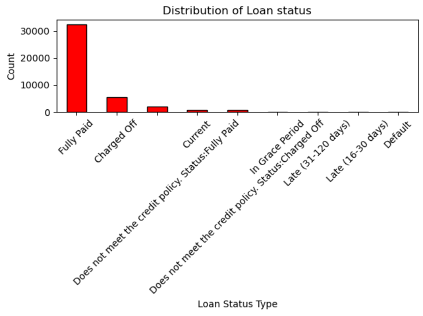
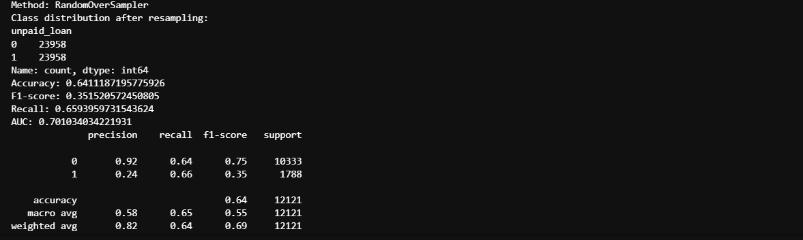
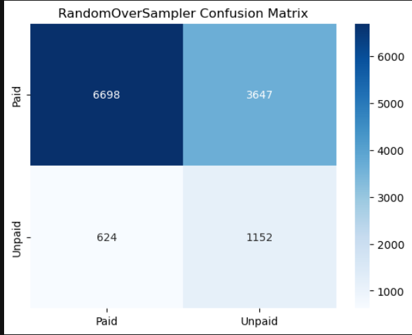

# Loan Default Prediction
This project uses a logistic regression model and sampling techniques such as **RandomOverSampler, RandomUnderSampler, SMOTE, ADASYN** to predict whether a borrower will default on a loan based on various features in the dataset. The target variable is the loan status.

## Data Preprocessing:

#### Rewording the "Loan_Status" column:
The original loan_status column included many different statuses:


The results show how most of the individuals in the dataset had a "Fully paid" loan status. I simplified these using the following mapping:
```
conditions = [
    loan['loan_status'].str.contains('Charged Off', na=False),
    loan['loan_status'].str.contains('Fully Paid', na=False),
    loan['loan_status'].str.contains('Default', na=False),
    loan['loan_status'].str.contains('Current', na=False),
    loan['loan_status'].str.contains('In Grace Period', na=False),
    loan['loan_status'].str.contains('Late', na=False)
]

choices = [
    'Charged Off',
    'Fully Paid',
    'Default',
    'Current',
    'In Grace Period',
    'Late'
]

loan['loan_status'] = np.select(conditions, choices, default=np.nan)
```
#### Grouping States into specific regions:
To simplify the addr_state column, U.S. states were grouped into broader geographic regions:
```
state_map = {
    "CT": "Northeast", "ME": "Northeast", "MA": "Northeast", "NH": "Northeast",
    "RI": "Northeast", "VT": "Northeast", "NJ": "Northeast", "NY": "Northeast", "PA": "Northeast",

    "IL": "Midwest", "IN": "Midwest", "MI": "Midwest", "OH": "Midwest", "WI": "Midwest",
    "IA": "Midwest", "KS": "Midwest", "MN": "Midwest", "MO": "Midwest", "NE": "Midwest", "SD": "Midwest",

    "DE": "South", "DC": "South", "FL": "South", "GA": "South", "MD": "South", "NC": "South",
    "SC": "South", "VA": "South", "WV": "South", "AL": "South", "KY": "South", "MS": "South",
    "TN": "South", "AR": "South", "LA": "South", "OK": "South", "TX": "South",

    "AK": "West", "AZ": "West", "CA": "West", "CO": "West", "HI": "West", "ID": "West",
    "MT": "West", "NV": "West", "NM": "West", "OR": "West", "UT": "West", "WA": "West", "WY": "West"
}

loan['addr_state'] = loan['addr_state'].map(state_map)
```
#### Creating loan purpose categories:
Loan purposes were grouped into broader categories for clarity:
```
purpose_map = {
"debt_consolidation" : "Debt", 
"credit_card": "Debt",  
"other": "Medical/Other",
"home_improvement" : "Home", 
"major_purchase": "Big Purchase",   
"small_business" : "Medical/Other",     
"car": "Big Purchase",          
"wedding": "Big Purchase",
"medical" : "Medical/Other",           
"moving": "Home",             
"house": "Home",             
"educational":  "Medical/Other",
"vacation": "Big Purchase",     
"renewable_energy": "Medical/Other"    }

loan['purpose'] = loan['purpose'].map(purpose_map)
```

#### Categorizing Employment Length:
Employment length was grouped into groups for easier modeling:

```
loan['emp'] = np.nan

for index,row in loan.iterrows():
    if row['emp_length'] in ["< 1 year", "1 year", "2 years", "3 years"]:
        loan.at[index,'emp'] = '0-3 years'
    elif row['emp_length'] in ["4 years", "5 years", "6 years"]:
        loan.at[index,'emp'] = '4-6 years'
    elif row['emp_length'] in ["7 years", "8 years", "9 years"]:
        loan.at[index,'emp'] = '7-9 years'
    else:
        loan.at[index,'emp'] = '10+ years'

loan = loan.drop(columns = ['emp_length'])
```
#### Filtering and converting the response variable to binary values:
Only loans labeled as Fully Paid, Charged Off, or Default were used. The target column (loan_status) was converted into binary format:

```
df_loans = df[df['loan_status'].isin(['Charged Off', 'Fully Paid', 'Default'])].copy()

loan_map = {"Fully Paid": 0,
"Charged Off": 1,
"Default": 1}

df_loans['loan_status'] = df_loans['loan_status'].map(loan_map)
```

```
df_loans['unpaid_loan'].value_counts()
```
Based on the cleaned the dataset it can be seen how there is class imbalance. 

```
unpaid_loan
0    34291
1     6110
```
### Handling Class Imbalance with Sampling Techniques
To address the class imbalance in the loan default dataset, several sampling strategies were applied prior to training a Logistic Regression model:
- RandomOverSampler
- SMOTE
- ADASYN
- RandomUnderSampler

These helped balance the dataset before fitting the logistic regression model.

#### Example: Using RandomOverSampler in Python

```
from sklearn.linear_model import LogisticRegression
from sklearn.model_selection import train_test_split
from sklearn.metrics import mean_squared_error, accuracy_score, f1_score, confusion_matrix, recall_score, roc_auc_score, classification_report
from sklearn.preprocessing import StandardScaler
from imblearn.over_sampling import SMOTE, RandomOverSampler,ADASYN


X = df_loans.drop(columns=['unpaid_loan'])
y = df_loans['unpaid_loan']

scaler = StandardScaler()
X = scaler.fit_transform(X)

X_train,X_test,y_train,y_test = train_test_split(X,y, test_size = 0.3)

#RandomOverSampler
ros = RandomOverSampler(random_state=42)
X_resampled,y_resampled = ros.fit_resample(X_train,y_train)
class_count = y_resampled.value_counts()
model.fit(X_resampled,y_resampled)
y_pred_ros = model.predict(X_test)
y_probs = model.predict_proba(X_test)[:, 1]

print('Accuracy: ', accuracy_score(y_test, y_pred_ros))
print('F1-score:', f1_score(y_test,y_pred_ros))
print('Recall:', recall_score(y_test,y_pred_ros))
print('AUC:', roc_auc_score(y_test, y_probs))
cm = confusion_matrix(y_test,y_pred_ros)
sns.heatmap(cm, annot = True, fmt='d', cmap='Blues', 
           xticklabels = ['Paid', 'Unpaid'], yticklabels = ['Paid', 'Unpaid'])

```

#### RandomOverSampler Results
The RandomOverSampler produces the following confusion matrix and results:




#### Comparison of Sampling Techniques
After applying and evaluating **RandomOverSampler, SMOTE, ADASYN, and RandomUnderSampler** to the Logistic Regression model, their performances was visualized and compared in the bar chart below:

